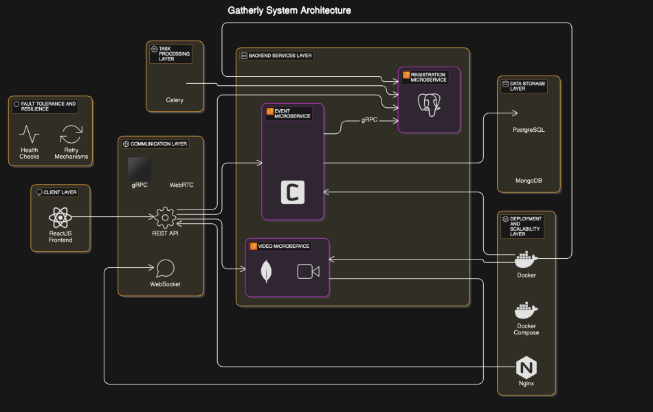
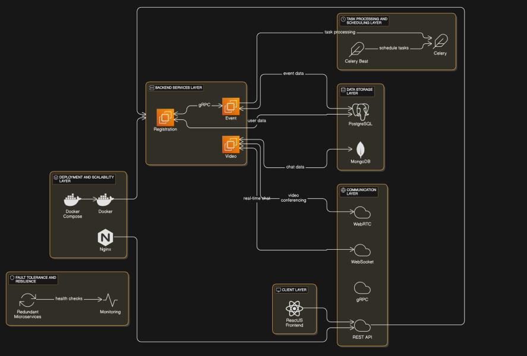

# Gatherly - Event Management and Video Conferencing

Gatherly is a microservices-based platform that allows users to create, manage, and participate in events, both online and offline. The platform includes features such as real-time video conferencing, event reminders, chat capabilities, and event management services. This README will guide you on setting up and running the application.

---

## Table of Contents

- [Contributors](#contributors)
- [System Design & Architecture](#system-design-architecture)
- [Prerequisites](#prerequisites)
- [Setting Up Environment](#setting-up-environment)
- [Running the Application](#running-the-application)
- [Microservices Endpoints](#microservices-endpoints)
- [Using the Application](#using-the-application)
- [Adminer (Database Management)](#adminer-database-management)
- [Project video & report](#project-video-and-report-links)

---
## Contributors

- **[Mohammed Musaddique](https://www.linkedin.com/in/musaddique333/)**
- **[Ritwik Agarwal](https://www.linkedin.com/in/ritwikagarwal/)**
- **[Adi Bhattacharya](https://www.linkdein.com/in/adi-bhattacharya/)**

---

## System Design Architecture

### System Architecture


---

### System Workflow


---
## Prerequisites

Before you begin, ensure you have the following installed:

- **Docker**: To containerize the services.
- **Docker Compose**: To orchestrate and manage the services.
- **Git**: To clone the repository.

---

## Setting Up Environment

1. **Clone the Repository**:

   ```bash
   git clone https://gitlab.com/Ritz1110/DodgyGeezers.git
   cd gatherly
   ```


2. **Create `.env.production` File**:

   In the root directory of the project, you will find a `.env.production` file. This file includes the environment variables required to configure your services. You will need to set up the values specific to your environment (e.g., database credentials, service URLs, etc.).

   Example of how the `.env.production` file is given as .env.production.example:

3. **Load Environment Variables**:

   Depending on your shell, you will need to load the environment variables for the current session.

   In the dummy .env.production.example file, rename the file by removing .example and enter the details. 

   For **Bash** or **PowerShell** session, use the following command to load the `.env.production` file:

   **For Linux/macOS**:

   ```bash
   export $(grep -v '^#' .env.production | xargs)
   ```

   **For Windows PowerShell**:

   ```bash
   Get-Content .\.env.production | ForEach-Object {
      if ($_ -match '^\s*([^#=]+?)\s*=\s*(.+)$') {
         $name = $matches[1].Trim()
         $value = $matches[2].Trim()
         [System.Environment]::SetEnvironmentVariable($name, $value, "Process")
      }
   }
   ```

---

## Running the Application

To bring up the application and run the services, you can use **Docker Compose** to manage the services.

1. **Start the Services**:

   Make sure you have Docker installed and running. Then, execute the following command to start all services:

   ```bash
   docker compose up --build
   ```

   This will build and start the services in the background. The application services & swagegr docs will be accessible on the following ports:

   - **Authentication Microservice**: `localhost:8000/docs`
   - **Event Microservice**: `localhost:8001/docs`
   - **Video Microservice**: `localhost:8002/docs`
   - **Adminer (Database Management)**: `localhost:8080`
   - **Client (Frontend)**: `localhost:8003`

2. **Stop the Services**:

   To stop the services, use the following command:

   ```bash
   docker compose down
   ```
   Optionally

   ```bash
   docker volume prune
   docker image prune
   ```
---

## Microservices Endpoints

Once the services are up, you can access the following endpoints:

- **Authentication Microservice**:  
   - URL: `localhost:8000`  
   - Swagger Docs: `localhost:8000/docs`  
   - Handles user registration, authentication, and user data.

- **Event Microservice**:  
   - URL: `localhost:8001`  
   - Swagger Docs: `localhost:8001/docs`
   - Manages event creation, participant management, and reminder notifications.

- **Video Microservice**:  
   - URL: `localhost:8002`  
   - Swagger Docs: `localhost:8002/docs`
   - Handles video conferencing (via WebRTC) and real-time chat functionality.

- **Adminer** (for database management):  
   - URL: `localhost:8080`  
   - Use Adminer to view and manage the databases (PostgreSQL and MongoDB).

- **Client (Frontend)**:  
   - URL: `localhost:8003`  
   - The ReactJS frontend where users can create events, set reminders, join video calls, and chat.

---

## Using the Application

To use the application, follow these steps:

1. **Navigate to the Frontend**:  
   Open a browser and go to `http://localhost:8003`. This is where the user interface of Gatherly will be displayed.

2. **Register or Log In**:  
   Register a new account or log in to your existing account.

3. **Create Events**:  
   Once logged in, you can create new events. Specify the event details such as time, location, and participants.

4. **Invite Participants**:  
   Add participants to the event. They will receive email notifications and reminders for the event.

5. **Join Video Calls**:  
   Use the event's room ID to join the video conference. The room is powered by WebRTC, ensuring low-latency and real-time communication.

6. **Chat During Events**:  
   Participants can chat in real-time during the event. All chat messages are saved for future reference.

---

## Adminer (Database Management)

Adminer is available at `localhost:8080` and provides a simple interface to interact with the PostgreSQL and MongoDB databases used by Gatherly.

1. **Login to Adminer**:
   - Database: PostgreSQL or MongoDB
   - Username and password: Provided in the `.env.production` file
   - Host: `localhost`

2. **Use Adminer**:
   - You can query, manage, and visualize the data stored in the PostgreSQL and MongoDB databases through Adminer.

---

## Troubleshooting

- **Ports Already in Use**:  
   If any ports are already in use on your system, update the ports in the `docker-compose.yml` file and try again.

- **Failed to Build Docker Images**:  
   Ensure Docker is installed and running. Check for any errors during the build process and fix them before trying again.

- **Service Connectivity Issues**:  
   If services cannot communicate with each other, ensure the environment variables are correctly set, especially for the database and Redis connections.

---

## Project video and report links

### Project video  - Some google drive link
### Project report - Some google dricv link

---

## License

This project is licensed under the MIT License.

---